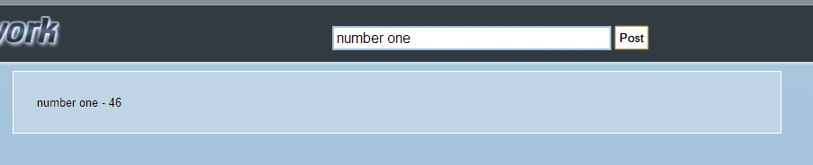

Ontraport Front End Evaluation, Short Test
=============================

Howdy! Welcome to Ontraport Front End short test. Before we can continue on with your application we would like you to complete the following task. 

To get started fork this repo into your own github account. 

## Test Requirements

Using the existing form markup in `index.html`, create a script on submit that prepends the contents of `<input type="text" name="post" placeholder="thoughts?"/>` to `
`. Also include the current second of the minute.

You can use any framework

Check out the gif below to see what a working exsmaple might look like. 

Good Luck!